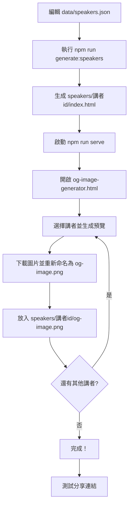

# 講者專屬頁面與 OG 圖片生成系統

本系統為每位講者自動生成獨立的頁面和社交媒體縮圖（Open Graph 圖片），讓分享連結時能顯示講者的專屬資訊。

## 📋 目錄

- [功能特色](#功能特色)
- [快速開始](#快速開始)
- [生成的內容](#生成的內容)
- [使用流程](#使用流程)
- [檔案結構](#檔案結構)
- [自訂設定](#自訂設定)
- [常見問題](#常見問題)

## ✨ 功能特色

### 1. 自動生成講者專屬頁面

- ✅ 為每位講者建立獨立的 URL：`https://devfest2025.gdgkaohsiung.org/speakers/講者id/`
- ✅ 包含完整的 Open Graph 和 Twitter Card meta 標籤
- ✅ SEO 優化（描述、關鍵字、作者等）
- ✅ 自動重導向到主網站並定位到該講者（使用 hash navigation）

### 2. 視覺化 OG 圖片生成器

- ✅ 網頁介面，無需程式技能
- ✅ 即時預覽 1200x630 尺寸的社交媒體圖片
- ✅ 自動整合講者照片、姓名、組織、議程標題
- ✅ Material Design 3 風格設計
- ✅ 一鍵下載高品質 PNG 圖片

### 3. 動態內容整合

- ✅ 直接從 `data/speakers.json` 讀取講者資料
- ✅ 支援多語言（繁體中文、英文、日文）
- ✅ 響應式設計，適配所有裝置

## 🚀 快速開始

### 步驟 1：生成講者頁面

執行以下指令，自動為所有講者建立專屬資料夾和 HTML 頁面：

```bash
npm run generate:speakers
```

或直接執行：

```bash
node generate-speaker-pages.js
```

### 步驟 2：啟動本地伺服器

```bash
npm run serve
```

伺服器將在 `http://localhost:8000` 啟動。

### 步驟 3：生成 OG 圖片

1. 在瀏覽器中開啟 **[http://localhost:8000/og-image-generator.html](http://localhost:8000/og-image-generator.html)**
2. 從下拉選單選擇講者
3. 點擊「生成預覽」按鈕
4. 檢查預覽圖片是否正確
5. 點擊「下載圖片」按鈕
6. 將下載的圖片**重新命名**為 `og-image.png`
7. 將圖片放入對應的講者資料夾：`speakers/講者id/og-image.png`

### 步驟 4：重複步驟 3

為每位講者重複步驟 3，直到所有講者都有自己的 OG 圖片。

## 📦 生成的內容

執行腳本後，會建立以下結構：

```
devfest-2025-site/
├── speakers/                     # 講者專屬頁面資料夾
│   ├── ray_yuan_liu/            # 講者 ID 資料夾
│   │   ├── index.html           # 講者專屬頁面（含 OG meta 標籤）
│   │   └── og-image.png         # 講者的 OG 圖片（手動生成並放置）
│   ├── leo_he/
│   │   ├── index.html
│   │   └── og-image.png
│   └── ...                      # 其他講者
│
├── og-image-generator.html      # OG 圖片視覺化生成工具
└── generate-speaker-pages.js   # 頁面生成腳本
```

## 📖 使用流程

### 完整工作流程



### 新增講者時的流程

1. **編輯講者資料**：在 `data/speakers.json` 新增講者資訊
2. **重新生成頁面**：執行 `npm run generate:speakers`
3. **生成 OG 圖片**：使用 `og-image-generator.html` 為新講者生成圖片
4. **放置圖片**：將圖片放入對應資料夾
5. **驗證結果**：在瀏覽器測試分享連結

## 📂 檔案結構

### `speakers/講者id/index.html`

每個講者的專屬頁面包含：

- **完整的 Open Graph 標籤**：包括標題、描述、圖片、URL
- **Twitter Card 標籤**：針對 Twitter 分享優化
- **SEO meta 標籤**：描述、關鍵字、作者
- **自動重導向**：訪客會被重導向到主網站並定位到該講者

範例 URL：

- 開發環境：`http://localhost:8000/speakers/ray_yuan_liu/`
- 正式環境：`https://devfest2025.gdgkaohsiung.org/speakers/ray_yuan_liu/`

### `og-image-generator.html`

視覺化工具，功能包括：

- 下拉選單選擇講者
- 即時渲染 Canvas 預覽
- 顯示講者照片（圓形裁切）
- 顯示講者資訊（姓名、組織、議程）
- 一鍵下載功能

### `generate-speaker-pages.js`

Node.js 腳本，負責：

- 讀取 `data/speakers.json`
- 為每位講者建立資料夾
- 生成包含 OG meta 標籤的 HTML 頁面
- 生成 `og-image-generator.html` 工具

## 🎨 自訂設定

### 修改 OG 圖片樣式

編輯 `og-image-generator.html` 中的 `generateOgImage()` 函式：

```javascript
// 背景漸層
const gradient = ctx.createLinearGradient(0, 0, canvas.width, canvas.height);
gradient.addColorStop(0, '#667eea'); // 起始顏色
gradient.addColorStop(1, '#764ba2'); // 結束顏色
ctx.fillStyle = gradient;
ctx.fillRect(0, 0, canvas.width, canvas.height);

// 講者姓名字體
ctx.font = 'bold 64px Roboto, Noto Sans TC, sans-serif';

// 底部資訊條
ctx.fillStyle = 'rgba(0, 0, 0, 0.5)';
ctx.fillRect(0, canvas.height - 80, canvas.width, 80);
```

### 修改頁面 meta 標籤

編輯 `generate-speaker-pages.js` 中的 `generateSpeakerPage()` 函式：

```javascript
const html = `<!DOCTYPE html>
<html lang="zh-Hant">
<head>
  <!-- 在此自訂 meta 標籤 -->
  <meta property="og:title" content="${nameZh} | ${sessionNameZh}">
  <!-- ... -->
</head>
</html>`;
```

修改後，重新執行 `npm run generate:speakers` 以套用更改。

## ❓ 常見問題

### Q1: 為什麼需要本地伺服器？

**A:** 由於瀏覽器的 CORS 安全限制，直接開啟 HTML 檔案無法載入 JSON 資料。必須透過 HTTP 伺服器才能正常運作。

### Q2: OG 圖片無法顯示講者照片？

**A:** 檢查以下幾點：

1. 講者照片路徑是否正確（`data/speakers.json` 中的 `photo` 欄位）
2. 圖片檔案是否存在於 `images/` 資料夾
3. 瀏覽器控制台是否有 CORS 或載入錯誤

### Q3: 如何測試 OG 圖片是否正確顯示？

**A:** 使用以下工具測試：

- **Facebook Sharing Debugger**: [https://developers.facebook.com/tools/debug/](https://developers.facebook.com/tools/debug/)
- **Twitter Card Validator**: [https://cards-dev.twitter.com/validator](https://cards-dev.twitter.com/validator)
- **LinkedIn Post Inspector**: [https://www.linkedin.com/post-inspector/](https://www.linkedin.com/post-inspector/)

### Q4: 可以批次生成所有 OG 圖片嗎？

**A:** 目前 `og-image-generator.html` 是手動工具。如果需要批次生成，可以考慮：

1. 使用 Puppeteer 或 Playwright 自動化瀏覽器操作
2. 使用 Node.js Canvas 套件（需安裝額外依賴）
3. 使用雲端服務如 Cloudinary、Imgix 等

### Q5: 講者 URL 會實際跳轉到主頁嗎？

**A:** 是的，講者專屬頁面會自動重導向到 `index.html#講者id`，這樣可以：

- 保持 SEO 和社交媒體分享的優勢
- 維持單頁應用的使用體驗
- 確保 OG 圖片能正確顯示

### Q6: 如何修改講者資訊？

**A:**

1. 編輯 `data/speakers.json`
2. 重新執行 `npm run generate:speakers`
3. 如果標題或視覺資訊有改變，重新生成該講者的 OG 圖片

### Q7: 可以客製化每位講者的圖片樣式嗎？

**A:** 可以！在 `og-image-generator.html` 中，您可以根據 `speaker.topic_category` 或其他欄位動態調整樣式：

```javascript
// 範例：根據議題分類改變背景顏色
let bgColor1, bgColor2;
if (speaker.topic_category.zh.includes('AI')) {
  bgColor1 = '#667eea';
  bgColor2 = '#764ba2';
} else if (speaker.topic_category.zh.includes('Cloud')) {
  bgColor1 = '#34a853';
  bgColor2 = '#0f9d58';
}
// ... 繼續使用 bgColor1 和 bgColor2
```

## 🔗 相關文件

- [README.md](README.md) - 專案總覽
- [README-DYNAMIC-CONTENT.md](README-DYNAMIC-CONTENT.md) - 動態內容管理
- [CLAUDE.md](CLAUDE.md) - 專案架構指南

## 📝 授權

本專案採用 MIT 授權條款。

---

**製作**: DevFest Kaohsiung X S. TW Communities Gathering 2025
**更新日期**: 2025-10-13
